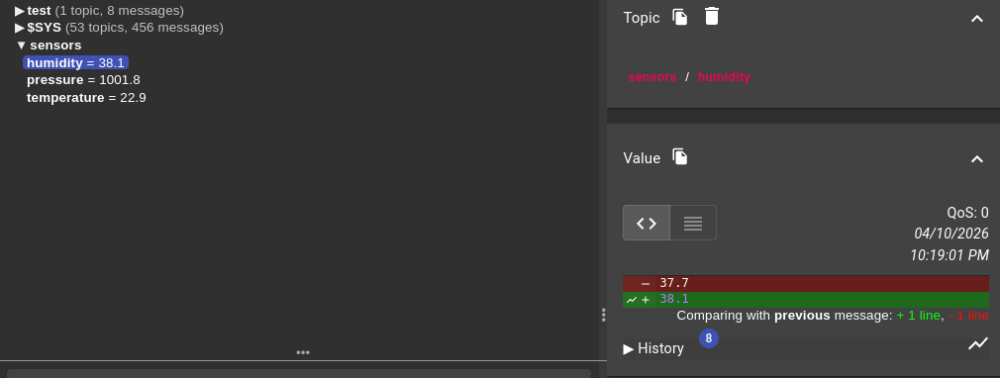
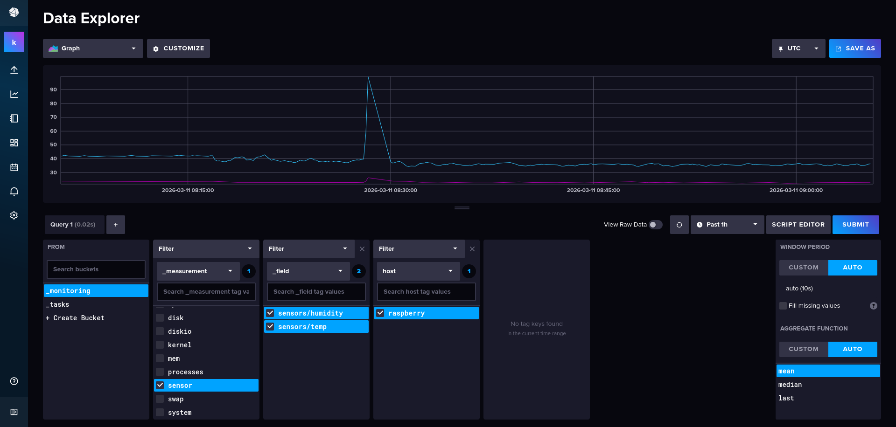
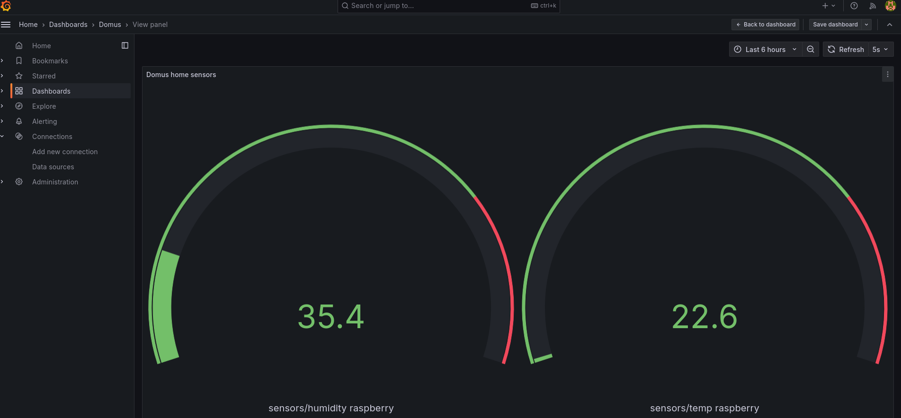

# Domus

Domus is a system for monitoring indoor temperature, pressure, and humidity.
Each ESP32-C3-based device collects data from a BME280 sensor and sends it to an MQTT broker running on a Raspberry Pi 5. The data is also displayed locally on an SPI TFT display.
Telemetry is stored in the InfluxDB database and visualized through a web interface using Grafana.


## Arhitecture System
Domus consists of distributed ESP32-C3 nodes, a central MQTT broker on a Raspberry Pi 5, an InfluxDB database, and a web interface for data visualization using grafana.
#### Components
* **ESP32-C3 Node**
    * BME280 sensor measures temperature, pressure and humidity
    * SPI TFT display: displays current readings locally
    * MQTT Client: Sends data to the broker over the network.
* **ESP-GATEWAY**
    * Manages communication between multiple ESP32-C3 nodes
    * Receives data from slave devices and forwards it to the MQTT broker
* **MQTT Broker (Raspberry pi 5)**
    * Receives data from ESP-GATEWAY device
    * Topics are organized by room, for example
      ```text
          sensors/temp
          sensors/humidity
      ```
      like here
    *
    
* **Telegraf**
    * Telegraf takes the message, converts it to time-series format, adds tags (host=raspberry) and sends it to InfluxDB (outputs.influxdb_v2)
* **OTA**
  * upgrade all firmware over the air via ESP NOW protocol
* **InfluxDB**
    * stores this data and provides an interface (API) for reading


* **Grafana**
    * Grafana connects to InfluxDB as a datasource and makes queries to the database to build graphs and dashboards
    * Allows you to view data by room and sensor in real time
  

#### Project architecture diagram
.png)


_Currently all screenshot are reading from a DHT sensor, because Aliexpress delayed the delivery of my BME280 and ESP32-C3. Sorry._
